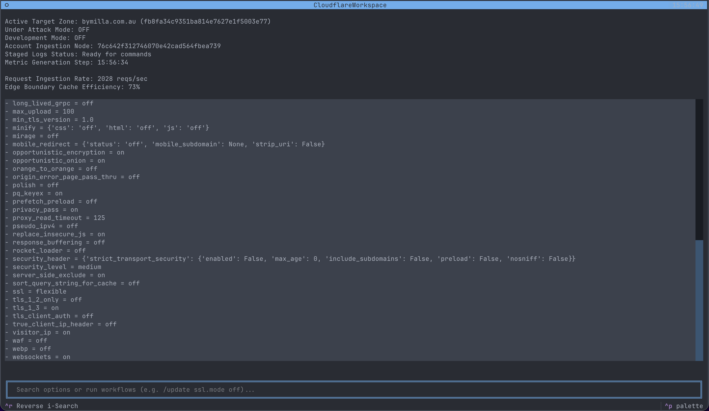

# Cloudflare CLI

A tmux-like interactive terminal workspace for real-time Cloudflare administration, built entirely in Python using the `Textual` framework.

## Screenshot


## Version 1.2.5

### Version History
- **1.2.5**: Persisted the active interface palette in `.fridaycf/config.json`.
- **1.2.4**: Added a Cloudflare theme palette using Tango Orange, Yellow Orange, and Ship Gray across the interface.
- **1.2.3**: Added active zone status indicators for Under Attack Mode and Development Mode.
- **1.2.2**: Added `/zone <website>` to select a zone. Added `/zones` to list available zones.
- **1.2.1**: Added `/panic-reset` command to stage safe default configuration resets.
- **1.2.0**: Added `httpx` integration for real-time Cloudflare API data. Implemented dynamic bootstrapping, async workers for metric polling, and improved Reverse i-Search logic.
- **1.1.0**: Structural refactoring, moved CSS to external `styles.tcss`, and fixed indentation/syntax errors.
- **1.0.0**: Initial prototype codebase.

## Installation
```bash
python3 -m venv venv
source venv/bin/activate
pip install -r requirements.txt
```

## Cloudflare Configuration

Cloudflare CLI requires an API token, one or more zone IDs, and an account ID. You can provide them in a `.env` file in the project directory. Separate multiple zone IDs with commas:

```env
CLOUDFLARE_API_TOKEN=your_api_token
CLOUDFLARE_ZONE_ID=your_zone_id,another_zone_id
CLOUDFLARE_ACCOUNT_ID=your_account_id
```

### Create an API Token

1. Sign in to the [Cloudflare Dashboard](https://dash.cloudflare.com/).
2. Open your profile menu, select **My Profile**, then open **API Tokens**.
3. Select **Create Token** and create a token with the minimum permissions required for the zone and account operations you plan to perform.
4. Copy the token when it is shown. Cloudflare does not show the full token again.
5. Put the token in `CLOUDFLARE_API_TOKEN` in `.env`. Do not commit `.env` or share the token.

### Find the Zone ID

1. In the Cloudflare Dashboard, select the website you want to manage.
2. Open **Overview**.
3. In the **API** section on the right side of the page, copy the **Zone ID**.
4. Put it in `CLOUDFLARE_ZONE_ID` in `.env`.

### Find the Account ID

1. Open the Cloudflare Dashboard and select the relevant account.
2. Open **Workers & Pages**, or another account-level product page.
3. Copy the **Account ID** shown in the account or product details.
4. Put it in `CLOUDFLARE_ACCOUNT_ID` in `.env`.

CLI flags override values loaded from `.env`:

```bash
python cloudflare-cli.py --token <api_token> --zone <zone_id> --account <account_id>
```

## Usage
```bash
# Credentials can come from .env or CLI flags
python cloudflare-cli.py
```

The active interface palette is persisted in `.fridaycf/config.json`. This file contains application preferences only and does not store API credentials. If the saved palette is unavailable, Cloudflare CLI automatically falls back to the Cloudflare palette.

When multiple zones are configured, Cloudflare CLI waits for you to select an active zone. Use `/ZONES` to list all configured websites, then `/ZONE <website>` to switch the active zone. Website names are fetched from Cloudflare during startup.

The active zone status area shows whether **Under Attack Mode** and **Development Mode** are enabled. Under Attack Mode is derived from the zone's `security_level` setting, and Development Mode is derived from `development_mode`.

## Configuration Tutorial

Start Cloudflare CLI after configuring the credentials above. Enter each command in the input bar and press Enter.

### Update a Configuration

Use `/update` to stage a setting change. Staging does not apply the change immediately.

```text
/update development_mode on
```

The syntax is `/update <setting> <value>`. Values containing multiple words can be entered after the setting name.

### Toggle Development Mode

Use `/dev on` or `/dev off` to stage a Cloudflare Development Mode change for the active zone:

```text
/dev on
/dev off
```

The command updates the same transaction buffer as `/update`. Review the pending value with `/review`, then run `/commit` to apply it.

### List and Select Zones

List the configured zones and their Cloudflare IDs:

```text
/ZONES
```

Switch to a zone by its fetched website name:

```text
/ZONE example.com
```

Selecting a zone refreshes its settings before accepting further configuration changes. Commands are case-insensitive, so `/zones` and `/zone` also work.

### Show Current Zone Settings

Use `/current` to display the settings currently loaded for the active zone:

```text
/current
```

This command reports zone-scoped settings only. It uses the Cloudflare `Zone Settings Read` permission scope; account and user permissions are not included. Pending staged values are marked as `[PENDING: ...]` and are not applied until `/commit`.

### Review Staged Changes

Use `/review` to display every change currently waiting in the transaction buffer:

```text
/review
```

### Commit a Configuration

After reviewing the staged values, use `/commit`:

```text
/commit
```

This updates the local configuration cache, records the previous values for rollback, and persists the commit history. If nothing is staged, no changes are made.

### Roll Back the Latest Commit

Use `/rollback` to restore the previous values from the most recent commit:

```text
/rollback
```

Rollback affects the latest recorded commit only. It also removes that commit from the persistent history. If there is no commit history, nothing is changed.

### Trigger Panic Protection

Use `/panic` to raise the emergency risk-mitigation flag:

```text
/panic
```

The current implementation reports that the emergency protection workflow was triggered. It does not stage or commit configuration changes by itself.

### Stage a Panic Reset

Use `/panic-reset` to stage the application's safe defaults across the settings available in the local cache:

```text
/panic-reset
```

DNS records are explicitly excluded. Review the staged reset with `/review`, then use `/commit` to apply it. To discard staged changes without committing, simply leave them uncommitted and stage the intended values instead.

## Features
- **Real-time Metrics**: Periodic polling of traffic statistics.
- **Dynamic Search**: Fuzzy search through live Cloudflare zone settings.
- **Transactional Staging**: Stage changes with `/update` and apply them with `/commit`.
- **History & Rollback**: Track commit history and rollback to previous states.
- **Reverse i-Search**: Search through command history with `CTRL+R`.
- **Panic Reset**: Stage a global reset to safe defaults (excluding DNS) with `/panic-reset`.
